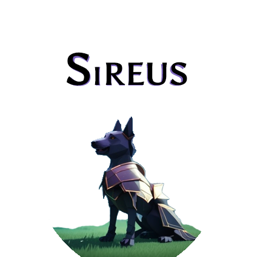

# sireus

## Sireus - SRE Utility System - Dynamic Bot manager for executing SRE and DevOps commands conditionally

**NOTE: Sireus is in RFC stage and not suitable for production usage.  [Please file questions, comments and requests here.](https://github.com/ghowland/sireus/issues)**

Replaces cron jobs, Jenkins, Nagios, or other less sophisticated execution methods for SRE/DevOps automation.  

Sireus is a Decision System, made to collect information from Monitoring or other data sources, and make a decision on which action to execute, if any action should be executed.

### Table of Contents

- [Sireus Goals](#sireus-goals)
- [Links](#links)
- [Data Structure](#data-structure)
  * [Sireus Bots and Bot Groups](#sireus-bots-and-bot-groups)
  * [Terminology](#terminology)
  * [How a Utility System or "Utility AI" works](#how-a-utility-system-or--utility-ai--works)
    + [Action Consideration Data](#action-consideration-data)
    + [Action Final Scores from Multiple Considerations](#action-final-scores-from-multiple-considerations)
    + [Why so many steps to get to a Final Action Score?](#why-so-many-steps-to-get-to-a-final-action-score-)
- [Best Practices](#best-practices)
  * [Naming your Actions](#naming-your-actions)
  * [Setting the Action Consideration Weights](#setting-the-action-consideration-weights)
- [Sireus Portrait](#sireus-portrait)

### Sireus Goals

- Bots execute a *single* command or API call out of many possibilities; designed for SRE and DevOps environments.
- Sireus is a Decision System.  It's purpose is to make a decision and execute a *single* command or web call.
- Fits into the stack between monitoring and alerting.  ex: Prometheus -> Sireus -> Alert Manager.
- Works with existing software stack, with minimal configuration.  Architecture agnostic.
- Dynamically create Bots for any Platform, Service, Process, Host, etc from monitoring software (ex: Prometheus).  Bots are ephemeral.
- Bots have something like rulesets for prioritizing conditional commands to respond to detected issues.
- Scalable to large amounts of tests and commands, with deterministic execution, and inspectable with historical or test data to aid in configuration and adjusting values to better respond to future events.
- Locking commands per Bot or Bot Group, to stop conflicting commands from running at once, or within a window to verify results of previous commands.
- Uses the ["Utility AI" or "Utility System" behavior system](https://en.wikipedia.org/wiki/Utility_system), which provides a sophisticated method scoring for N conditions per command, to prioritize execution based on collected Bot information.  Scales to large numbers of commands, allowing for complex reactions in large environments.

## Links

 - [Sireus Data Structure and Internal Function Documentation](docs/godoc.md)

## Data Structure

### Sireus Bots and Bot Groups

- A Bot Group is defined statically to create Bots.  Queries against monitoring software (ex: Prometheus) or services (ex: Kubernetes) are defined in the Bot Group to be used by Bots.
- Bots are suggested to be created dynamically from monitoring data
- Bots can also be created statically, for less dynamic services (ex: Kafka)
- Bot Groups and Bots have arbitrary variables set with timeouts to ensure execution doesn't occur from stale data
- Triggers to execute commands for common functions, such as a Bot's data disappearing from monitoring data (stale or missing)
- Commands are meant to execute against a service or web API, host (ex: bash), or to update internal Sireus data for more complex conditional testing.  This allows building up more complex state variables, which are easier to read and reason about in the conditional logic.

### Terminology

- **Bot Group**: A collection of Bots, for executing Actions, based on conditional scoring.  This would be mapped against a Web App or other software service in your infrastructure.
- **Bot**: A collection of Variable Data and Actions, which contain conditional scoring information based on monitoring queries, which then executes a command.  Each Bot keeps information to use in making decisions.
- **Action**: This is the wrapper for conditions to create a Score, and the Command to execute if it is selected.
- **Action Score**: This is the priority of execution.  Given a set of potential Actions, we rank them from highest to lowest score, executing the highest score, and never execute Actions with a score of 0.
- **Action Consideration**: These are essentially conditions, but are floats to provide a range of data, instead of only boolean.
- **Action Command**: Executing 1 or more bash-type OS level commands or a service or web API calls.  Generalizing all of these to an "Action Command".

### How a Utility System or "Utility AI" works

- All configuration is defined per Bot Group.  These consist of a set of Actions.
- Each Action has a set of Considerations (Conditions that are not just boolean) which create a Score.
- The highest non-zero score will be executed.  In most cases, nothing will be done and all scores will be zero, because no actions are necessary.  When actions become necessary, the highest non-zero scored Action will be executed.

#### Action Consideration Data

An Action has N Considerations, made from the following data:

- **Weight**: Per-consideration weight, so each consideration can have higher or lower weight than others
- **Value Function**: A function or command to execute to get a value (float)
- **Value Range**: A range of data ranges to test the result of the consideration's function output.  ex: 0.0-1.0, 0-100, 35-999.  This is the Floor and the Ceiling of the Value Function output.
- **Curve**: A curve to apply Value Function output.  The 2D Curve data goes from 0-1 on X and Y axis.  X is the Value Function Range position, and Y will be multiplied by the Weight to give the final Score.

**Example a Single Consideration:**

- Weight: 5.0
- Value Function Result: 60
- Value Range: 0 to 100
- Curve:

Given a Value Function Result (60) in the Value Range (0 to 100) = 0.6

In the Curve, with the X=0.6 the Y value = 0.71

The Curve Result (0.71) is multiplied by the Weight (5): 0.71 * 5 = 3.55 Consideration Score

#### Action Final Scores from Multiple Considerations

In the above single Consideration Data, we had a single Consideration Score of 3.55.  If there were more considerations, all of these would be calculated together, to get a final consideration score, and then multiplied by the Action Weight to get a final Action Score.

**Example of an Action with Multiple Considerations:**

- **Action**: Send API Remediation XYZ
- **Action Weight**: 1.5
- **Final Calculated Scores for all Considerations**: 3.55
- **Final Action Score**: 5.32

When all the Actions have had their Final Scores calculated, if 5.32 is the highest score, then that action will be executed.  

For a given Action, if **any** of the Considerations have a score of zero, then the entire Final Action Score is zero.  This allows any Consideration to make an Action invalid.

#### Why so many steps to get to a Final Action Score?

The reason to have all of these steps is to be able to control exactly how important any given consideration test is to executing that action, and to provide multiple ways to invalidate the action (any consideration with a 0 score).

The benefit of this is that even with hundreds or thousands of Actions, they can be tuned so that the correct action executes at the correct time.  These tests are deterministic, and can be run on historic or test data, so that execution can be tested on prior outages to see how the rules would execute in known failure situations, or proposed failure situations using test data.

Having the ability to tune values at the top level Action, and for each Consideration, allows for a lot of tuning ability to ensure correct execution.

## Best Practices

### Naming your Actions

I would recommend naming your actions to describe the state they represent.  This name would answer the question, "Why perform this action?"

**Example names:**

 - Service Stopped, Out of Space
 - Service Stopped, Has Storage

These names answer the question: **Why perform this action?**

With "*Service Stopped, Out of Space*", it is likely being out of storage is what caused the service to stop, so an action will be executed to try to deal with that.

With "*Service Stopped, Has Storage*", we know the service is stopped, but it still has storage, so we want to run a different command that deals with problems unrelated to running out of storage.

This is a simple 2 set problem, but let's expand the list to see why this is a scalable naming pattern:

 - Service Stopped, Out of Space
 - Service Stopped, Has Storage
 - Service Stopped, Won't Restart
 - Service Running, Many Errors
 - Service Running, Many Timeouts
 - Service Running, Database Connection Errors
 - Service Running, Too Busy
 - Service Running, Maybe Under Attack

At this point if we were naming things differently, it would become hard to add more actions and understand what the differences of them are.  This in some way just turns the evaluations into text, but it should also simplify those evaluations into big picture concepts so that new users can get a grasp on things easier, and experienced used can quickly differentiate.

This still has issues in that you can have more than 2 conditions.  For this, consider using Synthethic Variables to create a combination of values so that you can test them as a boolean.  In this way as you grow in variables, you can reduce them into Synthethic Variables to keep the Action evaluation logic simpler, and the names easier to read and understand, even as the number of actions continues to increase.

### Setting the Action Consideration Weights

Consideration weights should try to stay in the low numbers, the best weight being \~1.0.  Anything under 10 would be good for a particular strong weight to offset the more normal 1.0 weights, as a lower importance weight could be give 0.5 or 0.2 as it's Consideration Weight.

The reason for this is that in the calculations, there is a running score that multiplys all the scores together.  If a lot of \~1.0 values are multiplying each other, then the final result will be in the \~1.0 range.  If there are many different values such as "500, 10, -30, 1.0, 2000", these numbers are so different your Consideration Final Score will be very difficult to understand or control.

Using numbers such as "1.0, 1.3, 0.7, 1.0, 2.5" allows a set of Considerations that have relative importance to each other without swingingly wildly out of control if a one or more value has is at an extreme.

The Action Weight is where you differentiate Actions from each other by their weighted Action Final Score, which is the multiplier of the result of the Consideration Final Score.  This allows you to increase an Action by 500x, 2000x, etc.  If you want to put Actions into different categories of priority this way, do it with Action Weight, and leave the Consideration Weight to be near 1.0.

## Sireus Portrait

